# `Project PULSE`

## Table of Contents
1. [Introduction](#introduction)
2. [SOLID Principles](#solid-principles)
3. [Clean Architecture](#clean-architecture)
4. [Flutter Packages](#flutter-packages)
5. [BLoC Pattern](#bloc-pattern)
6. [Screenshots](#screenshots)
    - [Authentication](#authentication)
    - [Home](#home)
    - [Attendance](#attendance)
    - [Others](#others)
7. [Installation](#installation)
8. [Contributors](#contributors)


## 1. [Introduction](#introduction)
Project PULSE (Platform for Unified Learning & Student Engagement) is an integrated educational platform designed to enhance the learning experience for students. With 14 comprehensive modules (3 modules completed), PULSE offers solutions for attendance management, class scheduling, task organization, news dissemination, result analysis, personalized learning pathways, mental health support, interactive chatbot assistance, student feedback collection, collaborative forums, institutional resource access, expert editorials, and interactive hints. By prioritizing user experience and customization, PULSE aims to provide a seamless and engaging environment for students to excel academically, connect with peers, and access the resources they need to succeed. Through continuous improvement and innovation, PULSE strives to empower students in their educational journey.


## [SOLID Principles](#solid-principles)

###  S - Single Responsibility Principle
A class should have one, and only one, reason to change.

### O - Open/Closed Principle
You should be able to extend a classes behavior, without modifying it.

### L - Liskov Substitution Principle
Derived classes must be substitutable for their base classes.

### I - Interface Segregation Principle
Make fine grained interfaces that are client specific.

### D - Dependency Inversion Principle
Depend on abstractions, not on concretions.

## [Clean Architecture](#clean-architecture)

### 1. Presentation
This layer contains UI, ViewModels, and Widgets. It is the outermost layer and is the most volatile layer

### 2. Domain
This layer contains Use Cases, Entities, and Repository Interfaces. It is the innermost layer and is the most stable layer

### 3. Data
This layer contains Data Sources, Models, and Repositories. It is the middle layer and is the most flexible layer

## [Flutter Packages](#flutter-packages)

### 1. get_it
A simple Service Locator for Dart and Flutter projects with some additional goodies highly inspired by Splat. It can be used instead of InheritedWidget or Provider to access objects e.g. from your UI.

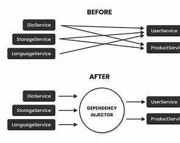


<!-- ## 2. equatable
A Dart package that helps to implement value based equality without needing to explicitly override == and hashCode. -->

### 2. dartz
A library that helps you write better Dart code. It contains functional programming primitives, and additional utilities that makes working with Dart's core libraries more enjoyable.

<!-- ## 4. http
A composable, Future-based library for making HTTP requests. It contains a set of high-level functions and classes that make it easy to send HTTP requests.

## 5. json_serializable
Automatically generate code for converting to and from JSON by annotating Dart classes.

## 6. build_runner
A build system for Dart code generation and modular compilation. -->

### 3. flutter_bloc
A Flutter package that helps implement the BLoC (Business Logic Component) design pattern. It is a predictable state management library that helps implement the BLoC design pattern.


## [BLoC Pattern](#bloc-pattern)

### 1. Bloc
The Bloc is a simple yet powerful state management library provided by the Flutter community. It helps implement the BLoC design pattern. It is a predictable state management library that helps implement the BLoC design pattern.

### 2. Event
Events are the input to a Bloc. They are added to the Bloc using the add method.

### 3. State
States are the output of a Bloc. The Bloc's state is updated by emitting a new state

### 4. BlocProvider
A Flutter widget that provides a bloc to its children via BlocProvider.of<T>(context).

### 5. BlocBuilder
A Flutter widget that handles building the widget in response to new states. BlocBuilder handles building the widget in response to new states.

### 6. BlocListener
A Flutter widget that listens to state changes in a Bloc and calls a callback in response to state changes.

### 7. BlocConsumer
A Flutter widget that combines BlocListener and BlocBuilder and makes it easier to build widgets in response to new states.
<!-- 
## 8. Repository
A repository class abstracts access to multiple data sources. The repository is a clean way to implement data access and it follows the single responsibility principle.

## 9. UseCase
A use case is a class that encapsulates a single piece of business logic. It is a clean way to implement the single responsibility principle.

## 10. Mapper
A mapper is a class that converts one object to another. It is a clean way to implement the single responsibility principle.

## 11. Data Source
A data source is a class that abstracts access to a particular data source. It is a clean way to implement the single responsibility principle.

## 12. Model
A model is a class that represents a data object. It is a clean way to implement the single responsibility principle. -->


## [Screenshots](#screenshots)
I have added some screenshots of the app.
I tried to mask the personal information in the screenshots. If you find any personal information, please let me know. I will remove it immediately.
### 1. [Authentication](#authentication)
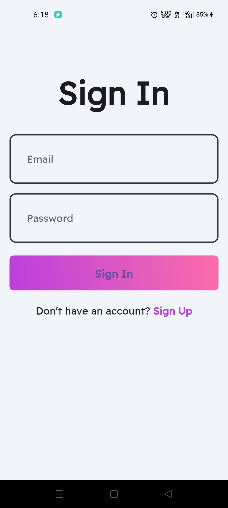
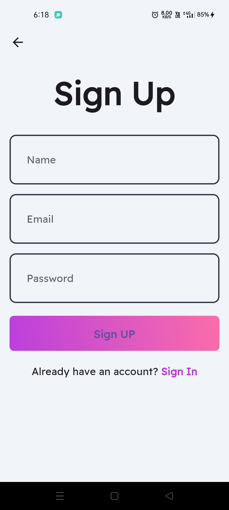

### 2. [Home](#home)
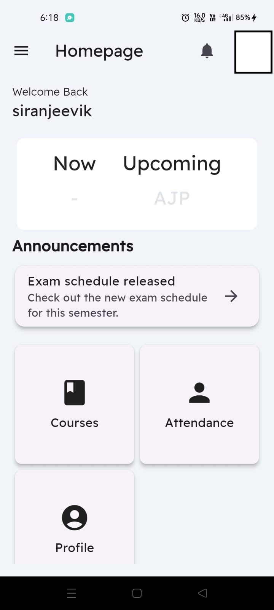

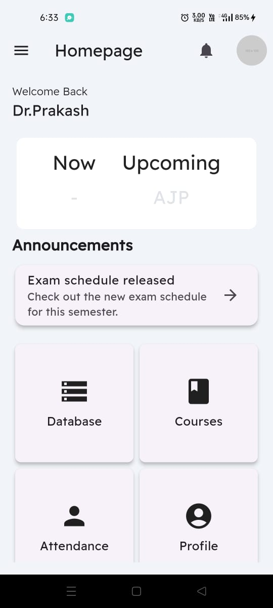
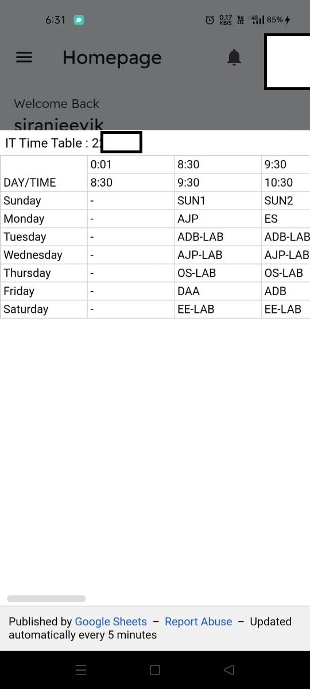

### 3. [Attendance](#attendance)
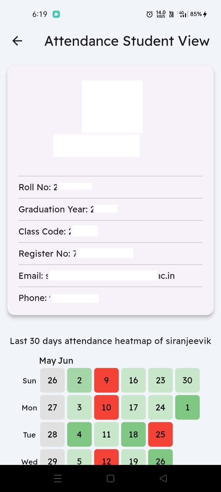 
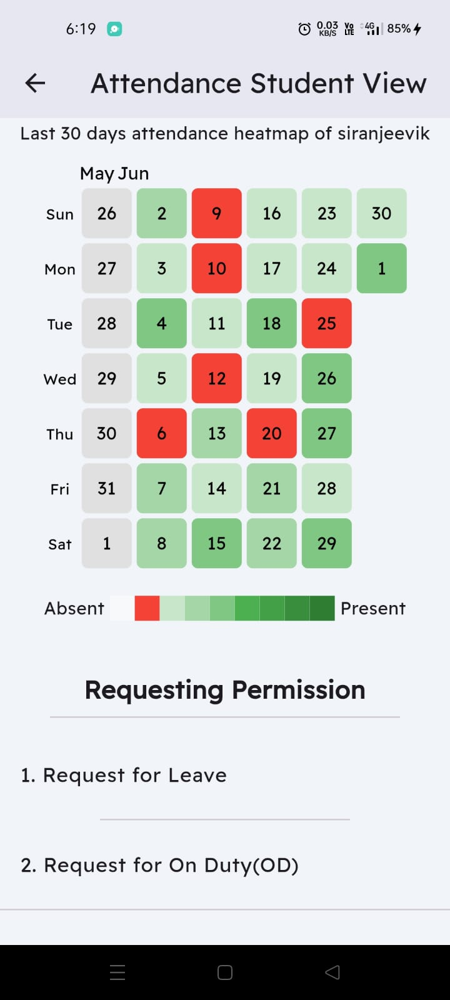
 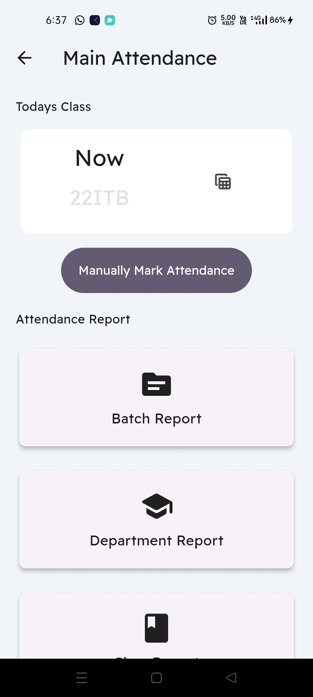 
 
 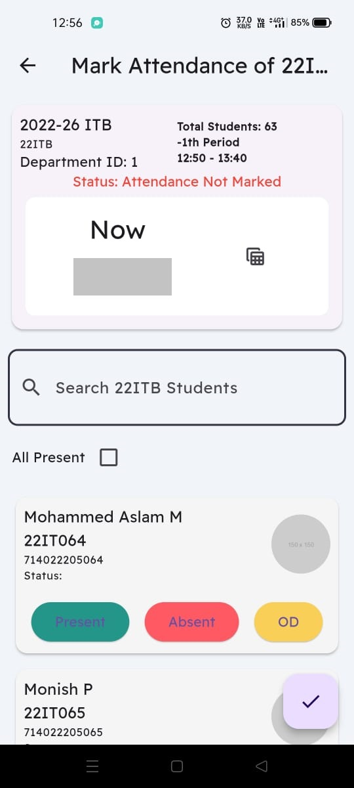

### 4. [Others](#others)
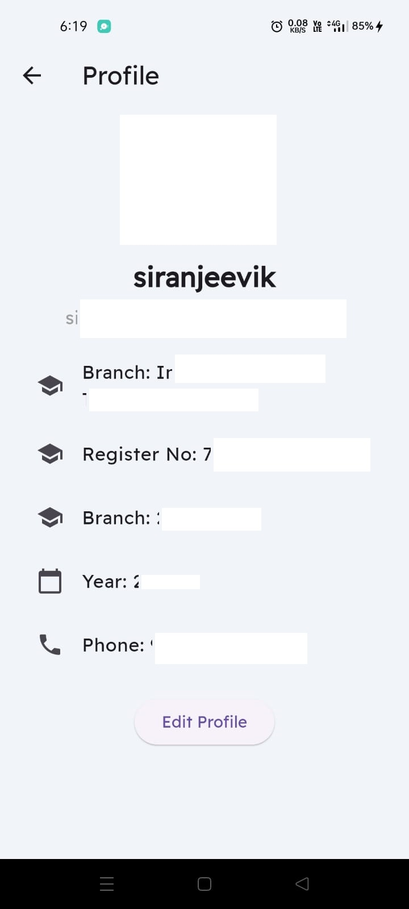
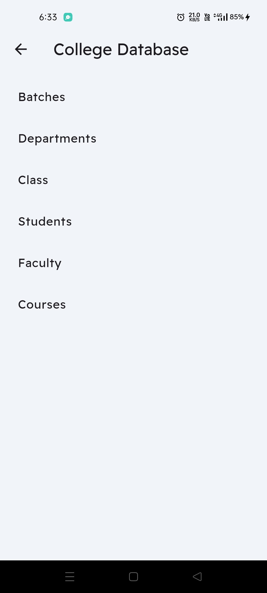
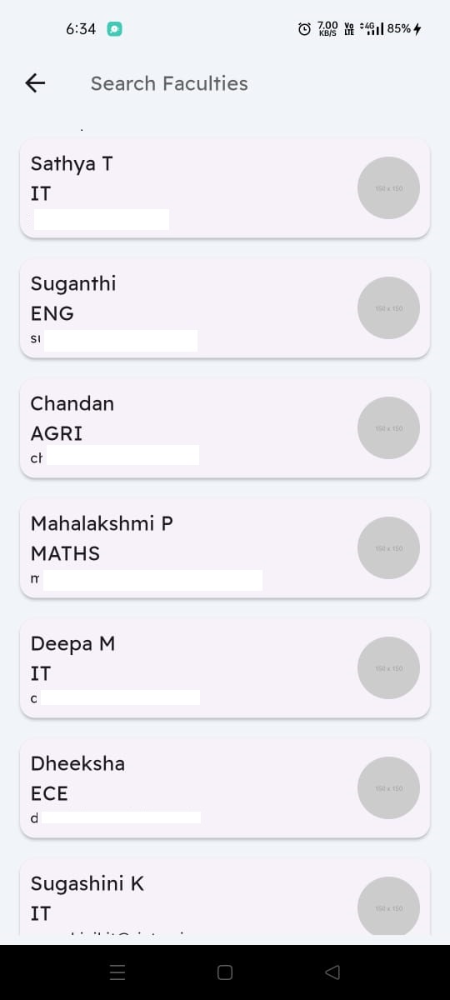


# [Installation](#installation)

1. Clone the repository

2. Make sure you have Flutter installed on your machine

3. Install the dependencies
    ```bash
    flutter pub get
    ```

4. Add API Keys in `\lib\core\secrets\app_secrets.dart` file
    ```dart
    class AppSecrets {
        static const supabaseUrl = '';
        static const supabaseAnonKey ='';
    }
    ```
5. Run the app
    ```bash
    flutter run
    ```

# [Contributors](#contributors)

1. [Siranjeevi K](https://github.com/SiranjeeviK)

